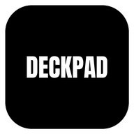
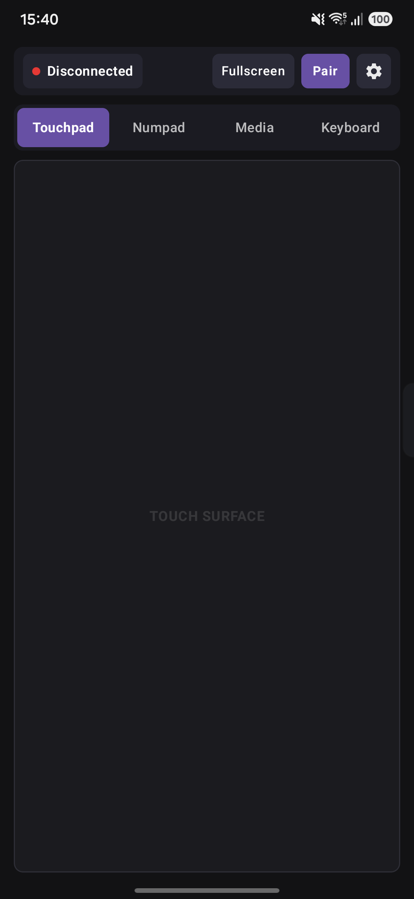
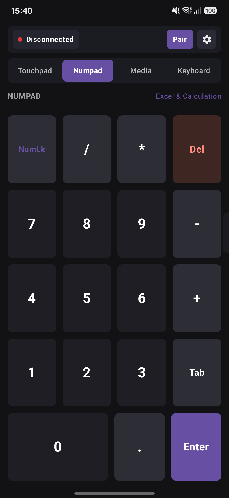
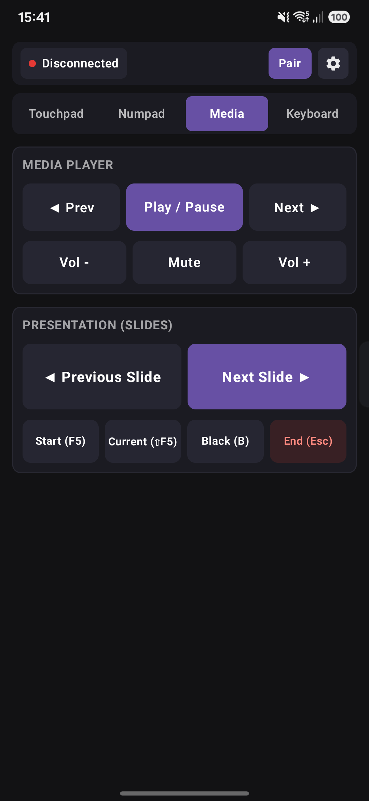
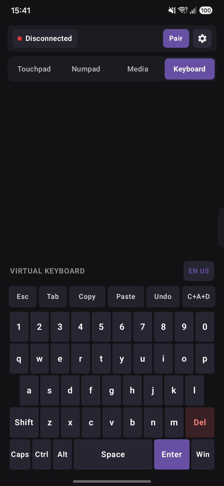
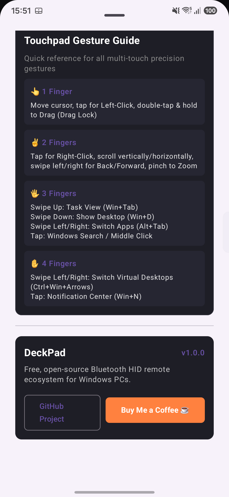

<p align="center">
  
</p>

# 📱 DeckPad — Zero-Latency PC Remote Ecosystem

<p align="center">
  
  
  
  
  
  
</p>

---

**DeckPad** turns your Android smartphone or tablet into a high-precision, zero-latency **Multi-Touch Trackpad**, an **Accounting/Excel Numpad**, a **Media & PowerPoint Presentation Clicker**, and a **Virtual PC Keyboard** for Windows PCs and laptops.

Unlike typical remote apps, **DeckPad requires NO companion server software, NO drivers, and NO third-party background daemons on your computer.** It communicates directly at the hardware layer via the native **Bluetooth Human Interface Device (HID)** standard profile.

---

## 📸 App Screenshots

<p align="center">
  
  
  
  
  
</p>

---

## ✨ Features at a Glance

### 🖱️ 1. Advanced Multi-Touch Trackpad
* **Zero-Latency Hardware Architecture:**
  * **Delta Coalescing & Off-Main-Thread Dispatch:** 120Hz/240Hz screen polling smoothly regulated with high-priority dedicated background thread to eliminate Bluetooth buffer bloat. Zero lag, zero accumulation even over hours of continuous usage.
  * **Lightweight R8 Minified Binary:** Optimized to ~2.1 MB footprint for ultra-fast load times and minimal memory consumption.
* **Precision Gestures & Fine Controls:**
  * **1-Finger Move & Tap:** Ultra-smooth cursor control and left-click.
  * **Double Tap & Drag:** Seamless window dragging and text selection (Drag Lock).
  * **2-Finger Scrolling:** Smooth vertical and horizontal page navigation (with natural / reverse scroll toggle).
  * **2-Finger Navigation (Back / Forward):** Swipe left or right with two fingers to navigate backward (`Alt + Left Arrow`) or forward (`Alt + Right Arrow`) in web browsers and Windows File Explorer.
  * **2-Finger Pinch-to-Zoom:** Hardware-level Ctrl + Wheel zoom in and out.
  * **Pointer Acceleration Toggle:** Switch between 1:1 hardware linear mapping and dynamic velocity acceleration (Windows Precision Touchpad style).
  * **Tap-to-Click Toggle:** Enable or disable tap-based clicking to prevent accidental clicks while navigating.
  * **3-Finger Tap (Configurable):** Middle Click (open links in new tab), Windows Search (`Win + S`), Show Desktop (`Win + D`), or Action Center (`Win + N`).
  * **3-Finger Swipes:** Task View (`Win + Tab` swipe up), Show Desktop (`Win + D` swipe down), and Switch Apps (`Alt + Tab` / `Alt + Shift + Tab` swipe left/right).
  * **4-Finger Swipes:** Seamlessly slide between Windows virtual desktops (`Ctrl + Win + Left/Right`).
  * **4-Finger Tap:** Quick Notification & Action Center toggle (`Win + N`).
* **Tactile Haptic Engine:** Instant vibration feedback on clicks, taps, and multi-finger gestures.
* **Distraction-Free Fullscreen Mode:** Hide top bars and system UI with wake lock protection for uninterrupted touchpad control.

### 🔢 2. Productivity Numpad
* Designed for Excel, accounting spreadsheets, data entry, and numeric calculations.
* Standard arithmetic operators (`/`, `*`, `-`, `+`), `NumLk`, `Del` (Backspace), `Tab`, and `Enter`.
* Responsive square key grid (`aspectRatio(1f)`) optimized for phones, foldables, and landscape tablets.

### 🎵 3. Media Player & Presentation Remote
* **Media Controller:** Play / Pause, Previous / Next Track, Volume Up / Down, and Mute (native HID Consumer Control).
* **PowerPoint & PDF Presentation Clicker:**
  * Large, comfortable tactile hit areas for Next Slide and Previous Slide.
  * Start Slideshow (`F5`), Start from Current Slide (`Shift + F5`), Black Screen toggle (`B`), and End Presentation (`Esc`).

### ⌨️ 4. Virtual PC Keyboard
* **Dual Layout Support:** One-tap instantaneous switching between **English (US)** and **Turkish (Q)** keyboard layouts. Defaults to English US.
* **Smart Modifier Management:**
  * `Shift`: One-shot single tap & double-tap lock.
  * `CapsLock`: Hardware toggle state.
  * Sticky `Ctrl`, `Alt`, and `Win` keys for smooth shortcut combinations.
  * **Dual-Action Windows Key:** Single tap prepares combinations (`Win + D`, `Win + E`, `Win + R`); double tap or long press triggers the native Windows Start Menu.
* **PC Shortcut Bar:** Instant access to `Esc`, `Tab`, `Ctrl + C` (Copy), `Ctrl + V` (Paste), `Ctrl + Z` (Undo), and `Ctrl + Alt + Del`.

### 🌐 5. International-Ready & Dynamic Multi-Language
* Default English user interface with secondary Turkish localization.
* Change language on the fly inside Settings without restarting the application.
* Automatically syncs virtual keyboard layout to your selected language while allowing manual overrides.

### 🔋 6. Persistent Background Connectivity
* Foreground service (`HidForegroundService`) ensures your Bluetooth connection never drops when switching apps or locking your phone.

---

## 🏗️ Architecture & Technology Stack

| Component | Technology |
| :--- | :--- |
| **Language** | 100% Kotlin |
| **UI Framework** | Jetpack Compose (Material 3) |
| **Architecture** | Clean Architecture + MVVM + Unidirectional Data Flow (UDF) |
| **Reactive State** | Kotlin Coroutines & `StateFlow` |
| **Bluetooth Protocol** | Android `BluetoothHidDevice` API with custom HID descriptor |
| **Dependency Injection** | Google Hilt |
| **Local Persistence** | Android Jetpack DataStore Preferences |
| **Haptic Feedback** | Android Vibration Effect Engine |

---

## 🚀 Getting Started

### Prerequisites
* **Android Studio:** Ladybug (2024.2+) or newer.
* **JDK:** Java 17+ (e.g. Android Studio JBR).
* **Device:** Android phone or tablet running **Android 9.0 (Pie / API 28)** or higher with Bluetooth HID device profile enabled by the manufacturer (standard on Samsung, Google Pixel, Xiaomi, OnePlus, etc.).
* **Target PC:** Windows 10 or Windows 11 with built-in or USB Bluetooth.

### Building from Source

```bash
# 1. Clone the repository
git clone https://github.com/ahmetselmancloud/deckpad.git

# 2. Navigate to project root
cd deckpad

# 3. Build Debug APK
./gradlew assembleDebug

# 4. Install onto your connected Android device
./gradlew installDebug
```

---

## 🔗 Pairing with Windows 10 / 11

1. Open **DeckPad** on your Android device.
2. Tap the **Pair** button at the top right to start advertising over Bluetooth.
3. On your Windows PC, go to **Settings > Bluetooth & devices > Add device > Bluetooth**.
4. Select **DeckPad** from the list of available devices.
5. Confirm the pairing prompt on both your PC and phone.
6. Once connected, your phone immediately acts as a mouse, keyboard, numpad, and presentation clicker!

---

## 🤝 Contributing

Contributions, issues, and feature requests are welcome! Feel free to check the [issues page](https://github.com/ahmetselmancloud/deckpad/issues).

---

## 👤 Author

**Ahmet Selman**
* GitHub: [@ahmetselmancloud](https://github.com/ahmetselmancloud)

---

## 📄 License

This project is open-source and distributed under the [MIT License](LICENSE).
